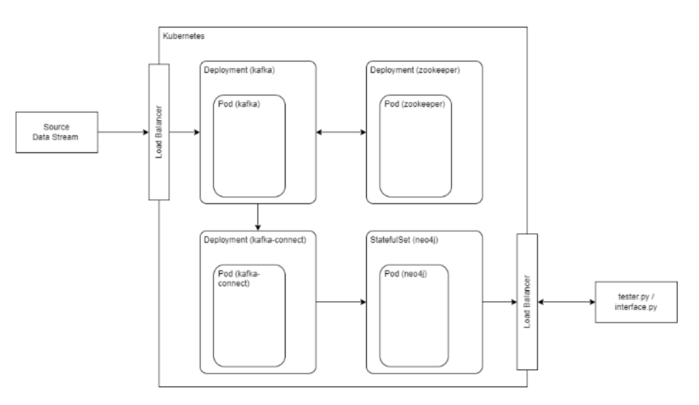
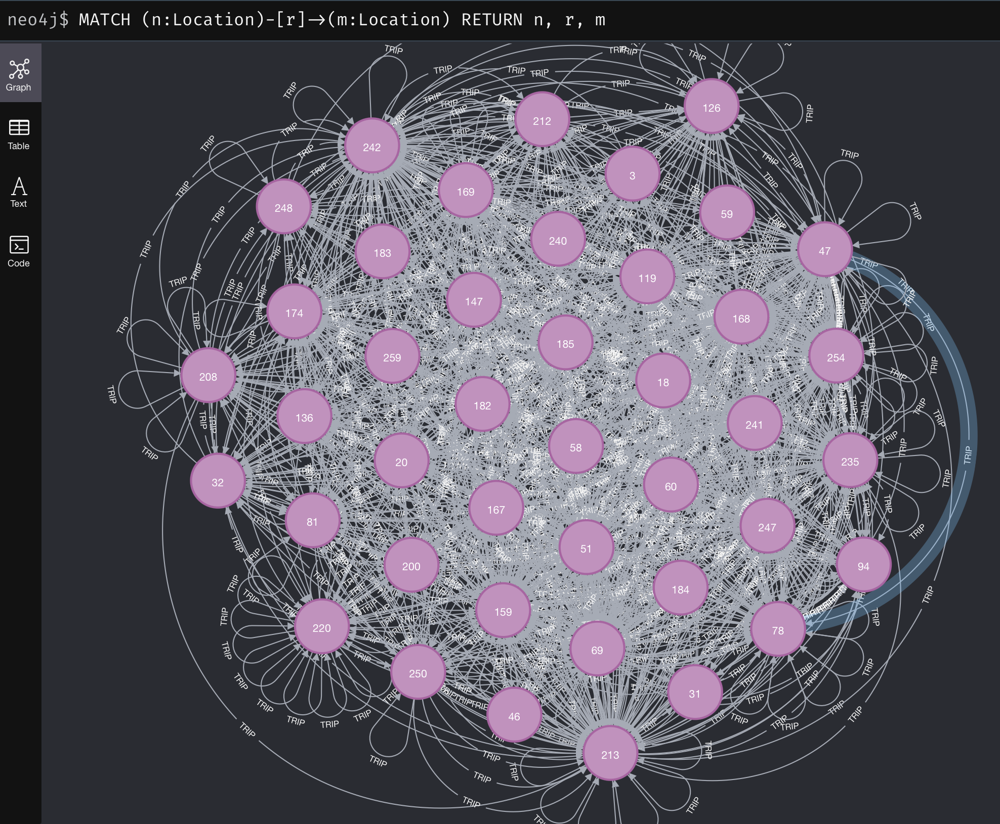

# Kafka-Neo4j-in-Kubernetes

## Architecture
The architecture diagram is shown below -


There are three deployments in this architecture. One pod hosts the Kafka message broker. Another pod hosts Zookeeper, which keeps track of Kafka brokers and configuration.

To define a Deployment, we create a manifest yaml file. For example, the kafka-setup.yaml defines two Kubernetes resources - a Service and a Deployment for running Kafka inside the cluster. Kind `Service` defines a Service that allows access to the Kafka Pod. It uses a label selector to target the right pods. Port 9092 is used for external access (e.g. from outside the cluster, like a data stream). Port 29092 is used for internal cluster communication (e.g. from Kafka Connect). This is a ClusterIP service by default (unless specified otherwise), meaning it’s only reachable inside the cluster.

Kind `Deployment` creates a Deployment with 1 pod replica as specified. It tells the Deployment to manage Pods with the label `app: kafka`. The container label is used to specify the Docker image for the pod. The Kafka pod uses `confluentinc/cp-kafka:7.3.3` image, pulling it only if not already present in the cluster. Ports label exposes Kafka on external (9092) and internal (29092) ports inside the Pod.

The environment variables are used to configure Kafka’s runtime behavior. We set up the unique ID for the Kafka broker, the Zookeeper connect service. We also define 2 interfaces - `PLAINTEXT` (9092) for external and `PLAINTEXT_INTERNAL` (29092) for inside-cluster apps like Kafka Connect. `ADVERTISED_LISTENERS` tells clients how to reach the broker. We also set the replication factor for the broker and a variable to create topics when a producer/consumer accesses a non-existent one.

Finally, resource limits are set which limits how much memory and CPU this container can use - 1.5 GB RAM and 1 CPU core.

Similarly, the manifest for Zookeeper is also created, which defines a Service, specifying the Zookeeper client port (2181) used by Kafka to connect. No external port is needed as all communications are within the cluster. A Deployment is also created, which pulls the `confluentinc/cp-zookeeper:7.3.3` Docker image. Environment variable are also set here like `ZOOKEEPER_TICK_TIME` which controls heartbeat intervals for Zookeeper, and `ZOOKEEPER_SYNC_LIMIT` which limits how many ticks a follower can lag behind the leader.

Kafka Connect is a tool that helps move data in and out of Kafka topics without writing custom code. It is a plugin-based gateway between Kafka and external systems like databases, files, cloud storage, etc. There are two types of connectors - source connectors read data from external sources and push it into topics, whereas sink connectors read from topics and write it to external systems.

In this architecture, we are using a sink connector to push data from the Kafka topic to a Neo4j graph database. To do this, a custom Docker image is created. A base image `confluentinc/cp-server-connect-base:7.3.3` is pulled, and the internal behavior of Kafka Connect is configured. This is used in the Deployment maifest.

It connects to the bootstrap server (the initial Kafka broker that a Kafka client contacts just to discover the full Kafka cluster using the received metadata) via the Kafka Service defined for inter-cluster communication. It exposes a REST API endpoint at port 8083, sets a connect group ID for internal coordination between tasks and connectors and the Neo4j plugin path, among other things. It then installs the Neo4j Kafka Connect Sink Connector into the image.

A shell script runs whenever the container is created, which starts Kafka Connect in the background, polls until Kafka Connect’s REST API is ready and then submits the config JSON via a POST request to the `/connectors` API.

The JSON connector configuration tells Kafka Connect how to read Kafka data and push it to Neo4j. It defines the name of the topic, the JSON converter for converting key-value pairs, retry timeout and delay, and Neo4j DB URI and credentials. Most importantly, it takes the key-value pairs from the topic, and executes the Cypher query for every record, which `Location` node from pickup/dropoff IDs, and a relationship `TRIP` between the nodes, with the following properties - distance, fare and pickup/dropoff timestamps.

The Neo4j StatefulSet is created using a Helm Chart. We can specify its settings using values.yaml. Here, it defines the DB name, edition and password, resources like 500 milicores of CPU and 2GB of memory, a Persistent Volume of 2GB using your Kubernetes cluster’s default StorageClass (so that data survives Pod restarts and rescheduling) and the Graph Data Science plugin.

Neo4j needs to be exposed outside the cluster so that scripts can be run to perform data analytics on the DB. In a local Minikube setup, we can use port forwarding to temporarily connect the local machine directly to a Kubernetes Pod or Service, without needing a public IP or Load Balancer.

## Implementation

To run the project, use the following commands -
```
kubectl apply -f ./zookeeper-setup.yaml
kubectl apply -f ./kafka-setup.yaml
helm install my-neo4j-release neo4j/neo4j -f neo4j-values.yaml
kubectl apply -f neo4j-service.yaml
kubectl apply -f kafka-neo4j-connector.yaml
kubectl port-forward svc/neo4j-service 7474:7474 7687:7687
kubectl port-forward svc/kafka-service 9092:9092
wget https://d37ci6vzurychx.cloudfront.net/trip-data/yellow_tripdata_2022-03.parquet
python3 data_producer.py
python3 tester.py
```

Shown below is the minikube dashboard showing resouce usage for each pod -


## Results

In this project we use the NYC taxicab dataset, which contains records for location, fare, distance etc. for millions of taxi trips in New York City. We specifically choose a subset of the dataset - taxi trips originating and terminating in Bronx. `data_producer.py` sends the record to the Kafka bootstrap server, and the Kafka sink connector models this data into Cypher, a declarative query language designed specifically for graphs. Each node is a location, while the relationship contains the properties of the trip from one node to another. Shown below is the Cypher query to visualize all 42 nodes and 1530 relationships of the dataset -


